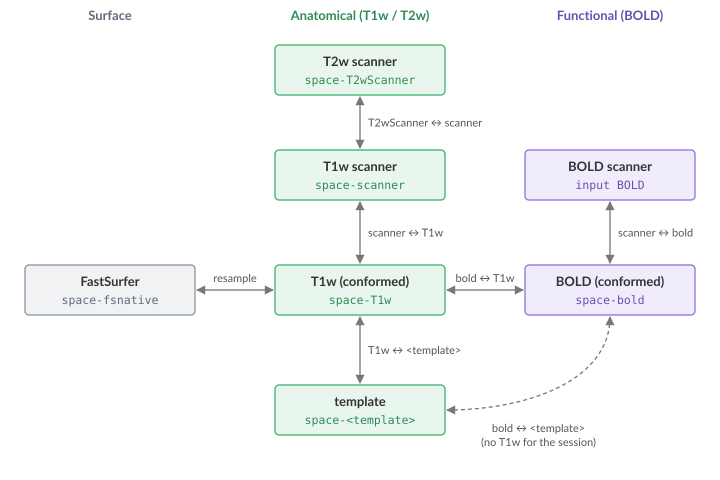

:og:description: How Brainana tracks macaque MRI images across coordinate spaces (scanner, T1w, template) and writes an explicit transform file for every T1w/T2w/BOLD space transition.

.. meta::
   :description: How Brainana tracks macaque MRI images across coordinate spaces (scanner, T1w, template) and writes an explicit transform file for every T1w/T2w/BOLD space transition.
   :keywords: coordinate spaces, image registration, transforms, macaque MRI, template space

Space tracking and transforms
=============================

Brainana tracks each image through a series of coordinate spaces and
writes an explicit transform file for every space transition.  The
diagram below shows all spaces and named transforms for the T1w, T2w,
and BOLD modalities.

         transforms between them.
   :align: center

   Coordinate spaces and the transforms between them. Green: anatomical; purple:
   functional; slate: surface.

.. Generated by scripts/dev/docs/make_space_diagram.py; edit the diagram there.

Each arrow is a pair of transform files, ``from-<A>_to-<B>_mode-image_xfm.<ext>`` and
its inverse ``from-<B>_to-<A>_…``. BOLD reaches the template through the T1w when the
session has one; otherwise it is registered to the template directly (dotted).

Scanner space
   The T1w and BOLD native acquisition space, with the BIDS entity
   ``space-scanner``.  T1w synthesis outputs and atlas backprojection
   to native grid use this label.

T1w
   The T1w is conformed to the template grid (``from-scanner_to-T1w``),
   then registered to template space (``from-T1w_to-<template>``).
   Preprocessed T1w in conformed space is published as
   ``space-T1w_desc-preproc_T1w.nii.gz``; template outputs carry
   ``space-<template>``.

T2w
   The T2w uses ``space-T2wScanner`` for native T2w synthesis, then is
   coregistered to T1w scanner space (``from-T2wScanner_to-scanner``,
   published as ``space-scanner``), then brought to T1w (conformed)
   space by reusing the T1w conformation transform
   (``space-T1w_desc-preproc_T2w``).

BOLD
   BOLD has its own conformation transform (``from-scanner_to-bold``).
   Within-session coregistration (when enabled) stays in scanner space
   (``space-scanner_desc-coreg_boldref``).  After conform, the BOLD
   reference in BOLD space is published as ``space-bold_boldref`` (session-level
   when coreg is enabled).  Preprocessed 4D BOLD uses
   ``space-bold_desc-preproc_bold`` (per run).  How BOLD reaches template
   space depends on whether a T1w anatomical is available for the session:

   - With an associated T1w, template resampling is performed by
     composing ``from-bold_to-T1w`` with the T1w registration transform
     ``from-T1w_to-<template>``; no separate BOLD-to-template file is
     written.
   - Without an associated T1w, BOLD is registered directly to the
     template, producing dedicated ``from-bold_to-<template>`` and
     ``from-<template>_to-bold`` transforms.

   T1w and template BOLD outputs carry ``space-T1w`` and ``space-<template>``
   respectively.

FastSurfer
   FastSurfer space is reached from T1w (conformed) space by
   resampling only; no transform file is produced.

   When surface reconstruction is enabled, the T1w-space atlases are also
   projected into FastSurfer space and onto the cortical surface (nearest
   neighbor throughout).  These outputs use the ``space-fsnative`` entity
   (individual FastSurfer/FreeSurfer surface space): resampled label volumes
   ``atlas-<name>_space-fsnative_<prefix>.nii.gz`` and per-hemisphere surface
   maps ``atlas-<name>_space-fsnative_hemi-<L|R>_<prefix>.func.gii``, published
   under ``anat/atlas_space-fsnative/``.

   Each surface vertex is sampled at 11 depths from the white to the pial
   surface.  Label atlases (those with an ``atlas-<name>.tsv``) keep the most
   common label; continuous maps (e.g. retinotopy) keep the value closest to
   mid-thickness.  Surface maps cover the cortex label only.  Vertices of a
   label atlas still unlabeled inside cortex take the label of their
   neighbors, unless the atlas covers less than half of that hemisphere
   (left-hemisphere-only atlases stay empty on the right).

Transform file reference
------------------------

All transform filenames follow the convention
``<prefix>_from-<src>_to-<dst>_mode-image_xfm.<ext>``.
FSL ``.mat`` files are rigid conformation transforms. Registration
transforms are read by ANTs: a displacement field (``.nii.gz``) when
FireANTs runs the SyN registration (the default,
``registration.enable_fireants``), otherwise an ANTs composite transform
(``.h5``). T2w-to-T1w transforms are always ``.h5``.

.. list-table::
   :header-rows: 1
   :widths: 15 55 30

   * - Modality
     - File (``<prefix>_…``)
     - Direction
   * - T1w
     - ``from-scanner_to-T1w_mode-image_xfm.mat``
     - T1w scanner → T1w
   * - T1w
     - ``from-T1w_to-scanner_mode-image_xfm.mat``
     - T1w → T1w scanner
   * - T1w
     - ``from-T1w_to-<template>_mode-image_xfm.<ext>``
     - T1w → template
   * - T1w
     - ``from-<template>_to-T1w_mode-image_xfm.<ext>``
     - Template → T1w
   * - T2w
     - ``from-T2wScanner_to-scanner_mode-image_xfm.h5``
     - T2w scanner → T1w scanner
   * - T2w
     - ``from-scanner_to-T2wScanner_mode-image_xfm.h5``
     - T1w scanner → T2w scanner
   * - BOLD
     - ``from-scanner_to-bold_mode-image_xfm.mat``
     - BOLD scanner → BOLD
   * - BOLD
     - ``from-bold_to-scanner_mode-image_xfm.mat``
     - BOLD → BOLD scanner
   * - BOLD
     - ``from-bold_to-T1w_mode-image_xfm.<ext>``
     - BOLD → T1w
   * - BOLD
     - ``from-T1w_to-bold_mode-image_xfm.<ext>``
     - T1w → BOLD
   * - BOLD (w/o T1w)
     - ``from-bold_to-<template>_mode-image_xfm.<ext>``
     - BOLD → template (direct, no associated T1w)
   * - BOLD (w/o T1w)
     - ``from-<template>_to-bold_mode-image_xfm.<ext>``
     - Template → BOLD (direct, no associated T1w)

Applying transforms to images
-----------------------------

Use the command builder below to choose source space, target space, and data type. It
outputs the matching command. The builder lists single-step paths only, that is,
direct transforms. If you need two steps, a hint below the code suggests the
intermediate space.

The tool depends on the transform file:

.. list-table::
   :header-rows: 1
   :widths: 40 60

   * - Transform
     - Tool
   * - ``.mat``
     - ``flirt`` (FSL)
   * - ``.h5`` or ``.nii.gz``
     - ``antsApplyTransforms`` (ANTs)
   * - FastSurfer to or from T1w
     - ``3dresample`` (AFNI); no transform file, only a reference image for the
       target grid

Interpolation is automatic: nearest-neighbor for discrete data (labels,
segmentations); trilinear for ``flirt`` and BSpline for
``antsApplyTransforms`` on intensity images.

If none of these tools is installed, mount your data and run the command inside the
Brainana Docker image:

.. code-block:: bash

   docker run -it --rm \
     -v <path/to/your/data>:/data \
     liuxingyu987/brainana:<version> bash

   # then run your flirt / antsApplyTransforms / 3dresample command as usual

Build a transform command
~~~~~~~~~~~~~~~~~~~~~~~~~

.. raw:: html

   

   

     

       

         <label for="xfm-src">From (source space)</label>
         <select id="xfm-src">
           <option value="scanner-T1w">T1w scanner space</option>
           <option value="T1w">T1w space</option>
           <option value="template">Template space</option>
           <option value="scanner-T2w">T2w scanner space</option>
           <option value="scanner-bold">bold scanner space</option>
           <option value="bold-withT1w">bold space (w/ T1w)</option>
           <option value="bold-noT1w">bold space (w/o T1w)</option>
           <option value="fastsurfer">FastSurfer space</option>
         </select>
       

       

         <label for="xfm-dst">To (target space)</label>
         <select id="xfm-dst"></select>
       

       

         <label for="xfm-dtype">Data type</label>
         <select id="xfm-dtype">
           <option value="discrete">Discrete (label map, segmentation)</option>
           <option value="continuous">Continuous (intensity image)</option>
         </select>
       

     

     <pre id="xfm-code"></pre>
     

   

   
